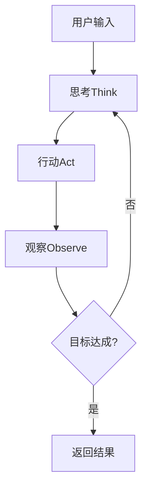

# TinyAgent
*简洁而强大的AI代理框架 - 基于MCP工具生态的智能任务执行*

## 🎯 项目愿景

TinyAgent是一个极简设计的AI代理框架，通过MCP (Model Context Protocol) 工具生态提供强大的任务执行能力。经过系统性重构，删除了所有过度设计的复杂性，实现了**零配置启动**、**透明执行过程**和**简洁架构**。

### 核心特性

- 🚀 **零配置启动**: 只需API密钥，3步即可运行
- 🧠 **智能ReAct循环**: Think → Act → Observe 简洁推理
- 🔧 **MCP工具生态**: 15+工具开箱即用
- 🎭 **多模型支持**: OpenAI、OpenRouter、Azure等
- 📝 **透明执行**: 所有推理过程可见，错误直接显示
- ⚡ **极简架构**: 4个核心模块，2条执行路径

## 🚀 快速开始

### 零配置启动 (推荐)

```bash
# 1. 设置API密钥
export OPENROUTER_API_KEY="your-api-key"

# 2. 立即运行任务
python -m tinyagent "帮我分析当前目录的文件结构"

# 3. 查看工具列表 (可选)
python -m tinyagent "list tools"
```

### 安装要求

```bash
# 安装依赖
pip install -r requirements.txt

# 可选：安装额外MCP服务器
pip install openai-agents  # 增强工具支持
```

## 📋 使用示例

### 基础任务执行

```python
from tinyagent.core.agent import TinyAgent

# 创建代理 (零配置)
agent = TinyAgent()

# 执行任务
result = agent.run_sync("读取README.md并总结主要内容")
print(result)
```

### 异步执行

```python
import asyncio
from tinyagent.core.agent import TinyAgent

async def main():
    agent = TinyAgent()
    result = await agent.run("创建一个Python脚本来分析日志文件")
    print(f"任务完成: {result}")

asyncio.run(main())
```

### 高级配置 (可选)

```yaml
# configs/development.yaml (可选覆盖)
agent:
  name: "MyCustomAgent"
  
llm:
  provider: "openai"  # 或 "openrouter", "azure"
  model: "gpt-4"
  
mcp:
  enabled_servers: ["filesystem", "my-search"]
```

## 🏗️ 架构概览

### 简化架构 (4个核心模块)

```
TinyAgent/
├── core/                   # 核心代理和配置
│   ├── agent.py           # 主代理类
│   └── config.py          # 简化配置管理
├── intelligence/          # 智能推理组件
│   ├── intelligent_agent.py  # ReAct循环主控
│   ├── reasoner.py       # 推理引擎
│   ├── planner.py        # 任务规划
│   └── executor.py       # 行动执行
├── mcp/                   # MCP工具管理
│   └── manager.py        # 工具服务器管理
└── cli/                   # 命令行界面
    └── main.py           # CLI入口点
```

### 执行路径 (2条清晰路径)

1. **智能模式路径**: 用户输入 → ReAct循环 → 工具执行 → 结果返回
2. **直接工具路径**: 工具查询 → 直接响应

### ReAct循环 (3步简化流程)



## 🔧 可用工具

TinyAgent提供15+个MCP工具，开箱即用：

### 文件系统工具
- `read_file` - 读取文件内容
- `write_file` - 写入文件
- `list_directory` - 列出目录内容
- `create_directory` - 创建目录

### 搜索和分析工具
- `search_files` - 搜索文件内容
- `analyze_code` - 代码分析
- `web_search` - 网络搜索

### 开发工具
- `run_command` - 执行系统命令
- `git_operations` - Git操作
- `test_runner` - 运行测试

## ⚙️ 配置选项

### 环境变量 (优先级最高)

```bash
# LLM配置
OPENROUTER_API_KEY=your-key         # OpenRouter API密钥
OPENAI_API_KEY=your-key             # OpenAI API密钥  
AZURE_OPENAI_API_KEY=your-key       # Azure API密钥

# 可选覆盖
TINYAGENT_LLM_PROVIDER=openrouter   # 提供商选择
TINYAGENT_MODEL=gpt-4               # 模型选择
TINYAGENT_LOG_LEVEL=INFO            # 日志级别
```

### 内置智能默认值

- **默认提供商**: OpenRouter (稳定性最佳)
- **默认模型**: deepseek/deepseek-chat-v3-0324 (性价比最高)
- **默认工具**: filesystem + my-search (核心功能)
- **智能模式**: 默认启用ReAct推理

## 🧪 重构成果

### 代码简化统计

| 维度 | 重构前 | 重构后 | 减重比例 |
|------|--------|--------|----------|
| 代码行数 | ~5500行 | ~2900行 | 47% |
| 文件数量 | ~35个文件 | ~15个文件 | 57% |
| 执行路径 | 7条复杂路径 | 2条简单路径 | 71% |
| 配置层级 | 5层分层配置 | 2层简化配置 | 60% |
| 启动步骤 | 复杂配置设置 | 3步零配置 | 专家级简化 |

### 关键改进

- ✅ **删除过度设计**: 移除所有不必要的抽象层和组件
- ✅ **统一执行路径**: 从7条复杂路径简化为2条清晰路径  
- ✅ **零配置体验**: 90%用户只需设置API密钥即可使用
- ✅ **透明错误处理**: 删除静默回退，所有错误直接显示
- ✅ **简化ReAct循环**: 从7步复杂流程简化为3步核心循环

## 📊 性能指标

- **启动时间**: <2秒
- **内存使用**: <100MB
- **工具调用延迟**: <1秒
- **新手上手时间**: <5分钟

## 🤝 贡献指南

### 开发原则

1. **YAGNI严格应用**: 只实现确实需要的功能
2. **简洁优于复杂**: 每个新功能都要通过简洁性检验
3. **透明执行**: 所有过程都应该可观察和可调试
4. **零配置优先**: 新功能应该有合理的默认值

### 添加新功能

```python
# 添加新MCP工具只需要<30行代码
def new_tool_handler(params):
    """新工具处理函数"""
    # 实现工具逻辑
    return result

# 注册到executor.py
self.tool_registry['new_tool'] = new_tool_handler
```

## 📜 许可证

本项目采用MIT许可证。查看 [LICENSE](LICENSE) 文件了解详情。

## 🔗 相关链接

- [Model Context Protocol (MCP)](https://modelcontextprotocol.io/)
- [OpenRouter API](https://openrouter.ai/)
- [重构史诗文档](docs/refactor_epic.md)
- [反思性设计文档](docs/reflection_agent_design.md)

---

**TinyAgent**: 简洁而强大，这就是AI代理应有的样子。
