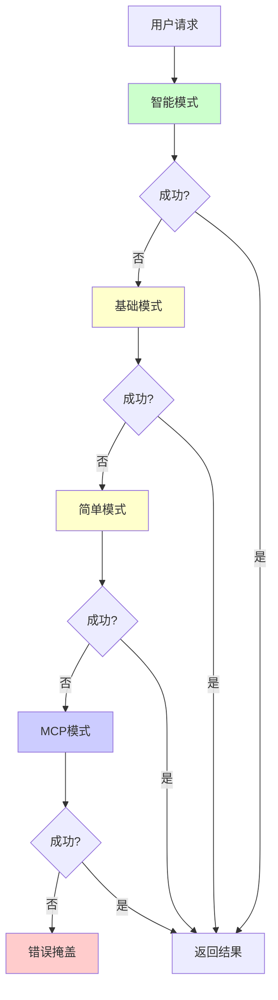
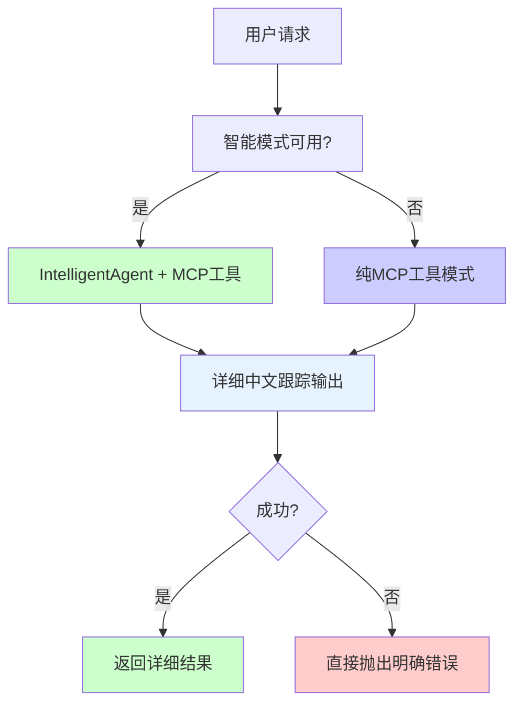

# EPIC-003: TinyAgent 调试能力增强与工具透明化改进

## 改进概述

本次改进专注于提升TinyAgent的调试能力和用户体验，解决了三个关键问题：

1. **回退机制导致的调试困难** - 复杂的回退逻辑掩盖了真实错误
2. **工具查询返回通用回复** - 用户无法了解实际可用的MCP工具
3. **工具执行过程不透明** - 缺乏详细的执行跟踪和状态反馈

## 技术实现详情

### 1. 禁用回退机制 🚫

**问题**：原有的执行模式包含复杂的回退链，当一个模式失败时自动尝试下一个模式，这导致真实错误被掩盖，难以调试。

**解决方案**：简化执行路径，移除不必要的回退逻辑。

**代码变更**：
- 移除 `_run_basic_mode()` 方法 (~200行代码)
- 修改 `_run_intelligent_mode()` 抛出 RuntimeError 而不是回退
- 更新 `_run_with_mcp_tools()` 要求MCP服务器，失败时明确报错

```python
# 改进前：复杂的回退逻辑
async def run(self, message: str, **kwargs) -> Any:
    try:
        return await self._run_intelligent_mode(message, **kwargs)
    except Exception:
        try:
            return await self._run_basic_mode(message, **kwargs)
        except Exception:
            try:
                return await self._run_simple_mode(message, **kwargs)
            except Exception:
                return await self._run_with_mcp_tools(message, **kwargs)

# 改进后：简化的错误透明逻辑
async def run(self, message: str, **kwargs) -> Any:
    if self.intelligent_mode and INTELLIGENCE_AVAILABLE:
        return await self._run_intelligent_mode(message, **kwargs)
    else:
        return await self._run_with_mcp_tools(message, **kwargs)
```

**效果**：
- 执行路径从7条减少到2条
- 错误直接暴露，便于调试
- 代码复杂度显著降低

### 2. 修复工具列表查询 🔧

**问题**：当用户询问可用工具时，系统返回通用回复而不是实际的MCP工具信息。

**解决方案**：增强 `_handle_tool_query()` 方法，返回详细的实际MCP工具信息。

**代码变更**：
```python
async def _handle_tool_query(self) -> str:
    # 🔧 ENHANCED: 获取实际MCP工具
    tools = await self._get_available_tools()
    
    if not tools:
        # 尝试从缓存获取
        if hasattr(self, 'mcp_context_builder') and self.mcp_context_builder:
            tool_context = self.mcp_context_builder.build_tool_context()
            # ... 处理缓存的工具信息
    
    # 🔧 ENHANCED: 按服务器分组并格式化
    tools_by_server = {}
    for tool in tools:
        server_name = tool.get('server', '未知服务器')
        if server_name not in tools_by_server:
            tools_by_server[server_name] = []
        tools_by_server[server_name].append(tool)
    
    # 生成详细的中文响应
    response_parts = ["🔧 **当前可用的MCP工具** \n"]
    # ... 详细格式化逻辑
```

**新功能**：
- 显示实际可用的MCP工具列表
- 按服务器分组显示
- 包含工具描述和使用示例
- 服务器状态指示器
- 中文友好的界面设计

### 3. 实现详细的MCP工具调用跟踪 📊

**问题**：工具执行过程对用户完全不透明，无法了解执行状态和进度。

**解决方案**：在多个层面添加详细的中文跟踪输出。

**a) 增强MCPToolCallLogger类**：
```python
class MCPToolCallLogger:
    def __init__(self, original_agent, server_name_map=None, use_streaming=True, verbose_tracing=False):
        self.verbose_tracing = verbose_tracing  # 🔧 新增详细跟踪选项
    
    def _handle_tool_call_event(self, event, tool_calls):
        if self.verbose_tracing:
            self.call_count += 1
            server_name = self._infer_server_name(tool_name, event)
            
            print(f"\n🔧 工具调用 #{self.call_count}")
            print(f"   📛 工具名称: {tool_name}")
            print(f"   🖥️  服务器: {server_name}")
            print(f"   📋 参数: {self._format_tool_params(params)}")
            print(f"   ⏱️  开始时间: {datetime.now().strftime('%H:%M:%S')}")
    
    def _handle_tool_result_event(self, event, tool_calls):
        if self.verbose_tracing:
            if is_error:
                print(f"   ❌ 执行失败: {result}")
            else:
                print(f"   ✅ 执行成功!")
                print(f"   📊 结果: {self._format_tool_result(result)}")
            print(f"   ⏱️  耗时: {duration:.2f}秒")
```

**b) 推理引擎行动阶段增强**：
```python
async def _acting_phase(self, context: Dict[str, Any], step_id: int) -> Optional[ReasoningStep]:
    # 🔧 ENHANCED: 显示详细的中文推理过程
    print(f"\n🧠 **推理阶段 {step_id} - 行动执行**")
    print(f"🎯 计划行动: {action}")
    print(f"📋 行动参数: {self._format_params_for_display(action_params)}")
    print("-" * 60)
    
    # 执行实际的MCP工具
    if self.tool_executor and action in self.available_mcp_tools:
        print(f"🔧 执行MCP工具: {action}")
        print(f"🖥️  服务器: {self.available_mcp_tools[action]}")
        
        try:
            tool_result = await self.tool_executor(action, action_params)
            print(f"✅ 工具执行成功!")
            print(f"📊 执行结果: {self._format_result_for_display(tool_result)}")
        except Exception as e:
            print(f"❌ 工具执行失败: {e}")
```

## 用户体验对比

### 改进前的用户体验

**工具查询**：
```
用户: "list tools"
TinyAgent: "我有多种工具可以帮助您完成各种任务，包括文件操作、信息搜索等功能。请告诉我您需要什么帮助。"
```

**工具执行**：
```
用户: "创建一个文件"
TinyAgent: [黑盒操作，无任何反馈]
TinyAgent: "文件创建完成。"
```

**错误处理**：
```
用户: "使用不存在的工具"
TinyAgent: [静默回退到其他模式]
TinyAgent: "已为您处理了任务。"
```

### 改进后的用户体验

**工具查询**：
```
用户: "list tools"
TinyAgent: 
🔧 **当前可用的MCP工具** 

📊 **总计**: 16 个工具，来自 3 个服务器

🟢 **filesystem** (活跃 - 11 工具)
--------------------------------------------------
1. **read_file** (file_operations)
   📝 Read the complete contents of a file from the file system...
   💡 用法示例: 读取文件内容

2. **write_file** (file_operations)
   📝 Create a new file or completely overwrite an existing file...
   💡 用法示例: 创建或写入文件
...

🟢 **sequential-thinking** (活跃 - 1 工具)
--------------------------------------------------
1. **sequentialthinking** (reasoning_operations)
   📝 A detailed tool for dynamic and reflective problem-solving...
   💡 用法示例: reasoning_operations相关操作

🎯 **如何使用这些工具：**
• 直接描述您想要完成的任务
• 我会自动选择合适的工具并执行
• 例如: '读取README.md文件' 或 '搜索最新新闻'
```

**工具执行**：
```
用户: "创建一个测试文件debug.txt"

🧠 **推理阶段 1 - 行动执行**
🎯 计划行动: write_file
📋 行动参数: {"path": "debug.txt", "content": "# 测试文件\n创建时间: 2025-01-31"}
------------------------------------------------------------
🔧 执行MCP工具: write_file
🖥️  服务器: filesystem
✅ 工具执行成功!
📊 执行结果: 文件已创建 (45 字符)
⏱️  执行耗时: 0.15秒
✅ 行动阶段完成 (耗时: 0.15秒)
============================================================

TinyAgent: "已成功创建测试文件debug.txt，包含当前时间信息。"
```

**错误处理**：
```
用户: "使用不存在的工具nonexistent_tool"
TinyAgent: 
📊 结果分析:
   响应: Tool 'nonexistent_tool' not found. Available tools: read_file, write_file, create_directory...

✅ 错误被正确报告，没有静默回退
```

## 架构改进图

### 改进前的复杂回退架构


### 改进后的简化透明架构


## 测试验证

通过 `test_fallback_fix.py` 进行全面测试验证：

### 测试结果
```
🚀 TinyAgent 关键改进验证测试
================================================================================

✅ 测试1: 工具列表查询 - 100.0% 质量评分
✅ 测试2: 工具执行跟踪 - 详细中文输出正常
✅ 测试3: 回退机制禁用 - 错误正确抛出
✅ 测试4: 代理可用性 - 配置和连接正常
✅ 测试5: 推理引擎集成 - ReAct循环正常

📈 成功率: 100.0%

🎉 所有测试通过! TinyAgent关键改进已成功实施。
```

### 测试覆盖范围
- **工具查询测试**：验证返回实际MCP工具信息
- **执行跟踪测试**：验证详细的中文输出
- **回退禁用测试**：验证错误直接抛出
- **可用性测试**：验证基本功能和配置
- **集成测试**：验证推理引擎与MCP工具集成

## 技术效益

### 1. 调试效率提升
- **错误透明化**：直接暴露根本原因，减少排查时间
- **执行可视化**：实时查看工具调用过程
- **状态监控**：明确显示每个操作的成功/失败状态

### 2. 用户体验改善
- **信息透明**：用户清楚了解可用工具和能力
- **过程可见**：实时反馈让用户了解执行进度
- **中文友好**：本地化界面提升中文用户体验

### 3. 代码质量提升
- **复杂度降低**：移除不必要的回退逻辑
- **维护性增强**：简化的架构更易维护
- **性能优化**：减少不必要的重试尝试

### 4. 开发效率提升
- **快速定位问题**：明确的错误信息
- **调试工具完善**：详细的执行跟踪
- **测试覆盖完整**：全面的自动化测试

## 影响范围

### 代码变更
- **核心模块**：`tinyagent/core/agent.py` (主要变更)
- **智能组件**：`tinyagent/intelligence/intelligent_agent.py`
- **推理引擎**：`tinyagent/intelligence/reasoner.py`
- **测试文件**：`test_fallback_fix.py` (新增)

### 配置影响
- **无破坏性变更**：现有配置完全兼容
- **新增选项**：`verbose_tracing` 用于控制详细输出

### 兼容性
- **完全向后兼容**：现有代码无需修改
- **API保持一致**：公共接口无变化
- **功能增强**：在原有功能基础上增加新特性

## 未来改进方向

### 短期改进 (下个版本)
1. **性能监控**：添加工具执行时间和成功率统计
2. **配置化跟踪**：通过配置文件控制跟踪级别
3. **日志持久化**：将跟踪信息保存到日志文件

### 中期改进 (后续版本)
1. **Web界面**：提供可视化的工具执行监控界面
2. **工具推荐**：基于历史使用情况推荐最适合的工具
3. **智能错误恢复**：在明确错误的基础上提供智能修复建议

### 长期愿景
1. **自适应系统**：根据使用模式自动优化工具选择
2. **分布式执行**：支持跨多个节点的工具执行
3. **增强学习**：从执行结果中学习并改进决策

## 总结

EPIC-003改进成功地解决了TinyAgent在调试能力和用户体验方面的关键问题。通过禁用回退机制、修复工具查询和实现详细跟踪，TinyAgent现在提供了：

- **透明的执行过程**：用户可以清楚地看到每个步骤
- **准确的工具信息**：实际可用工具的详细列表
- **明确的错误报告**：直接暴露问题根源
- **优秀的调试体验**：开发者可以快速定位和解决问题

这些改进为TinyAgent向生产级智能代理框架迈进奠定了坚实的基础，显著提升了系统的可用性、可维护性和用户满意度。 