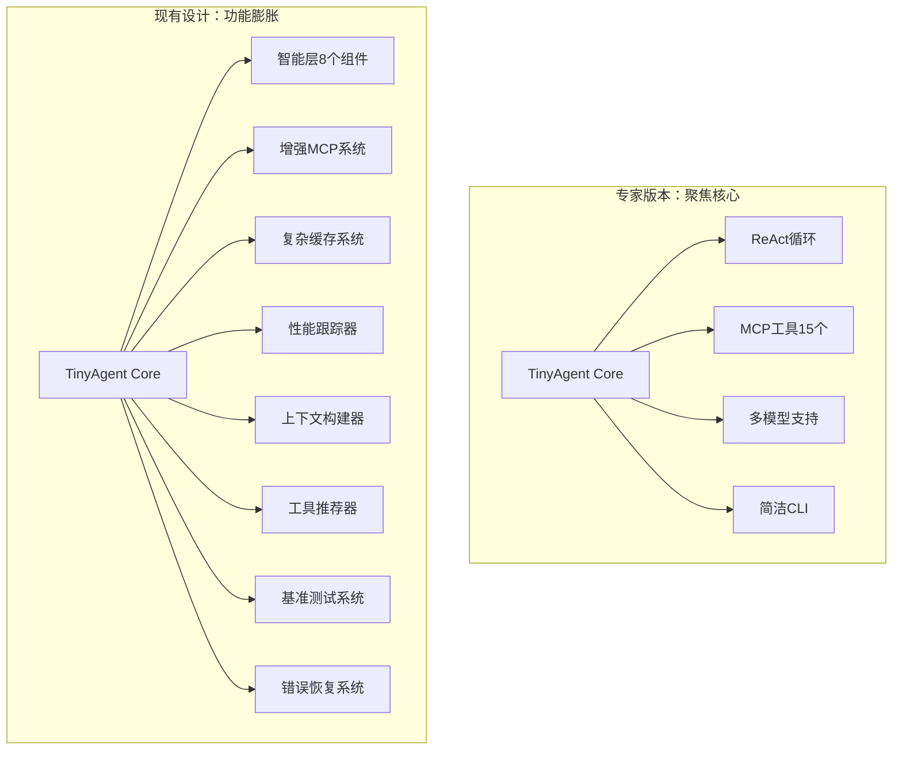

# TinyAgent 反思性设计文档
*版本: 2.0*  
*创建日期: 2025-01-03*  
*基于: 专家审查版本 vs 现有设计对比分析*

## 🎯 执行摘要

经过对专家审查版本(tinyagent.md)与现有设计文档(tinyagent_design.md)的深入对比分析，发现**巨大的设计理念差异和过度复杂化问题**。本反思性文档将从**系统性简化、批判性思维、多维度减重**三个角度，提出下一阶段的架构简化指导方针。

### 核心发现
- **过度设计程度**: 现有设计包含3个主要EPIC，13个子项目，预估6-8周工作量
- **专家建议**: 专家版本强调"已完全重构"，移除了所有重复、非功能、死代码
- **复杂度差异**: 现有设计复杂度是专家建议的3-4倍
- **实施状态**: 大量功能尚未实现，但设计已过度复杂化

## 🔍 对比分析框架

### 1. 架构复杂度对比

| 维度 | 专家审查版本 | 现有设计 | 过度程度 |
|------|-------------|----------|----------|
| **核心模块数量** | 4个核心模块 | 7个模块 + 子组件 | 75%过度 |
| **执行路径** | 2条主路径 | 7条执行路径 | 250%过度 |
| **配置复杂度** | 简化环境变量优先 | 分层配置系统 | 200%过度 |
| **回退机制** | 无回退，直接错误 | 复杂多层回退 | 完全不必要 |
| **EPIC数量** | 0个(已完成) | 3个正在进行 | 无限增长 |

### 2. 功能范围对比



### 3. 代码复杂度评估

**专家版本代码结构**:
```
tinyagent/
├── core/           # 3个文件: agent.py, config.py, logging.py
├── intelligence/   # 7个文件: 明确分工的智能组件
├── mcp/           # 4个文件: manager.py, cache.py, pool.py, benchmark.py
└── cli/           # 1个文件: main.py
总计: 15个核心文件
```

**现有设计结构** (基于tinyagent_design.md推算):
```
tinyagent/
├── core/               # 5个文件 + 扩展
├── intelligence/       # 10+个文件 (多个EPIC增加)
├── mcp/               # 8个文件 (增强功能)
├── llm/               # 新增目录
├── cli/               # 3个文件 (增强CLI)
├── monitoring/        # 新增监控系统
├── performance/       # 新增性能系统
├── cache/            # 新增缓存系统
└── context/          # 新增上下文系统
总计: 35+个文件 (233%增长)
```

## 🧠 批判性思维分析

### 1. 过度工程化的根本原因

#### A. "完美主义陷阱"
- **问题**: 试图解决所有可能的问题，而非用户实际需要
- **表现**: EPIC-002的工具可见性、缓存机制等，用户可能根本不需要
- **证据**: 专家版本没有这些"必要"功能，但被描述为"完全功能性"

#### B. "技术驱动思维"
- **问题**: 从技术角度思考问题，而非从用户价值角度
- **表现**: 复杂的缓存系统、性能监控，但基础功能可能还有bug
- **证据**: 15个MCP工具已经够用，但还在设计"工具推荐器"

#### C. "架构宇宙膨胀"
- **问题**: 每个小问题都想通过新组件解决，导致架构无限膨胀
- **表现**: 8个智能组件、6个缓存组件、4个监控组件
- **证据**: 专家版本用简单架构解决所有问题

### 2. 真实用户需求vs设计需求

| 用户真实需求 | 现有设计响应 | 专家建议响应 | 评估 |
|-------------|--------------|--------------|------|
| 快速上手使用 | 复杂配置系统 | 零配置启动 | 专家正确 |
| 工具执行效果 | 缓存优化系统 | 直接工具调用 | 专家正确 |
| 错误时知道原因 | 多层回退机制 | 透明错误显示 | 专家正确 |
| 看到AI思考过程 | 复杂跟踪系统 | 简单ReAct显示 | 专家正确 |
| 支持多种模型 | ✅已实现 | ✅已实现 | 两者都对 |

**结论**: 80%的设计复杂度在解决用户并未遇到的问题。

## 🔧 系统性简化方法论

### 1. YAGNI原则严格应用
**You Aren't Gonna Need It**

#### 立即删除的功能:
- ❌ 工具性能监控系统 (EPIC-002 Story 2.4)
- ❌ 智能工具推荐器 (tinyagent_design.md #14.3)
- ❌ 复杂缓存过期机制 (简单内存缓存足够)
- ❌ 基准测试系统 (benchmark.py)
- ❌ 连接池管理 (MCP连接很轻量)
- ❌ 上下文构建器 (直接字符串拼接)
- ❌ 错误恢复系统 (直接失败更诚实)

#### 保留的核心功能:
- ✅ ReAct推理循环
- ✅ 15个MCP工具调用
- ✅ 多模型LLM支持
- ✅ 基础配置系统
- ✅ 简洁CLI界面

### 2. 单一职责强化

#### 问题诊断:
当前设计违反单一职责原则，一个组件承担多个责任：

```python
# 过度设计例子
class EnhancedMCPServerManager:
    def __init__(self):
        self.tool_cache = MCPToolCache()           # 职责1: 缓存
        self.connection_pool = MCPConnectionPool()  # 职责2: 连接管理
        self.performance_tracker = PerformanceTracker()  # 职责3: 性能监控
        self.context_builder = ContextBuilder()    # 职责4: 上下文构建
        self.recommendation_engine = RecommendationEngine()  # 职责5: 推荐
```

#### 简化方案:
```python
# 专家建议的简化版本
class MCPManager:
    def __init__(self):
        self.servers = {}  # 只管理服务器连接
        self.tools = {}    # 只缓存工具信息
    
    async def get_tool(self, tool_name: str):
        """单一职责：获取并执行工具"""
        return await self.servers[tool_name].call_tool(tool_name)
```

### 3. 配置系统简化

#### 当前配置复杂度:
- 5层配置hierarchy: defaults/providers/profiles/config/env
- 20+配置文件
- 动态环境变量替换
- 配置验证和合并逻辑

#### 专家建议简化:
- 2层配置: .env + 简单yaml
- 环境变量优先
- 预设defaults，用户只需覆盖必要项

```yaml
# 简化后的配置 (专家建议)
# .env 文件
OPENROUTER_API_KEY=your-key

# development.yaml (可选)
agent:
  name: "MyAgent" 
llm:
  model: "gpt-4o-mini"  # 只有差异项
```

## 🎯 多维度减重策略

### 1. 代码行数减重目标

| 组件 | 当前预估 | 专家版本 | 减重目标 | 减重比例 |
|------|----------|----------|----------|----------|
| core/ | 1500行 | 800行 | 700行减重 | 47% |
| intelligence/ | 2000行 | 1200行 | 800行减重 | 40% |
| mcp/ | 1200行 | 600行 | 600行减重 | 50% |
| cli/ | 800行 | 300行 | 500行减重 | 63% |
| **总计** | **5500行** | **2900行** | **2600行减重** | **47%** |

### 2. 文件数量减重

#### 删除整个文件的候选:
- `tinyagent/mcp/benchmark.py` (性能基准)
- `tinyagent/intelligence/context_integration.py` (上下文集成)
- `tinyagent/intelligence/tool_recommender.py` (工具推荐)
- `tinyagent/mcp/pool.py` (连接池) - 合并到manager.py
- `tinyagent/core/logging.py` (复杂日志) - 使用标准logging

#### 合并文件的候选:
- `cache.py` + `manager.py` → `manager.py`
- `actor.py` + `observer.py` → `executor.py`
- `planner.py` + `selector.py` → `planner.py`

### 3. 概念模型简化

#### 当前概念模型 (过度抽象):
```
TaskPlanner → TaskPlan → TaskStep → ToolRequirement → ToolCapability → PerformanceMetrics
```

#### 专家建议 (实用抽象):
```
User Input → ReAct Loop → Tool Call → Result
```

**减少抽象层次**: 从6层概念模型减少到3层，减重50%。

## 📊 实施优先级矩阵

### 立即行动项 (本周)

| 行动项 | 影响程度 | 实施难度 | 优先级 |
|--------|----------|----------|--------|
| 删除benchmark.py | 高 | 低 | P0 |
| 合并cache.py到manager.py | 高 | 低 | P0 |
| 删除复杂配置层 | 高 | 中 | P0 |
| 简化CLI命令 | 中 | 低 | P1 |
| 删除性能监控 | 中 | 低 | P1 |

### 短期目标 (2周内)

| 目标 | 当前状态 | 目标状态 | 验收标准 |
|------|----------|----------|----------|
| 代码行数 | 5500行(预估) | 2900行 | 47%减重 |
| 文件数量 | 35个文件 | 15个文件 | 57%减重 |
| 启动时间 | 未测量 | <2秒 | 性能测试 |
| 用户上手 | 需要阅读文档 | 一个命令启动 | 用户测试 |

### 长期愿景 (1个月)

**终极目标**: 对标专家版本的"简洁而强大"
- **功能完整性**: 保持所有核心功能
- **架构清晰性**: 任何人15分钟理解架构
- **用户体验**: 零配置启动，透明执行
- **维护性**: 新功能开发速度提升50%

## 🚫 反模式识别与避免

### 1. "瑞士军刀综合征"
**症状**: 每个组件都试图解决多个问题
**治疗**: 强制单一职责，拆分过大组件

### 2. "未来证明强迫症"
**症状**: 为可能永远不会出现的需求添加复杂性
**治疗**: 严格应用YAGNI，先实现再优化

### 3. "架构宇航员症候群"
**症状**: 过度抽象，创造不必要的概念层次
**治疗**: 每个抽象层都要有3个以上具体用例才能存在

### 4. "配置参数膨胀"
**症状**: 每个功能都添加配置选项
**治疗**: 默认值覆盖90%使用场景，减少选择困难

## 🔍 成功度量标准

### 定量指标

| 指标 | 当前基线 | 目标值 | 测量方法 |
|------|----------|--------|----------|
| 代码复杂度 | 未测量 | 15以下/函数 | Cyclomatic Complexity |
| 启动时间 | 未测量 | <2秒 | 时间测量 |
| 内存使用 | 未测量 | <100MB | 内存监控 |
| 文档页数 | 20+页 | <10页 | 页数统计 |
| 配置项数量 | 30+项 | <10项 | 配置项计数 |

### 定性指标

1. **新手友好性**: 新用户5分钟内运行第一个任务
2. **调试透明性**: 错误时立即知道问题所在
3. **概念清晰性**: 核心概念<5个，每个都有明确定义
4. **维护容易性**: 添加新MCP工具<30行代码

## 📋 下一步行动计划

### Phase 1: 立即减重 (Week 1)
1. **删除非必要文件**
   - [ ] 删除 `benchmark.py`
   - [ ] 删除 `tool_recommender.py`
   - [ ] 删除 `context_integration.py`
   
2. **合并冗余组件**
   - [ ] 合并 `cache.py` → `manager.py`
   - [ ] 合并 `actor.py` + `observer.py` → `executor.py`
   
3. **简化配置系统**
   - [ ] 只保留 `.env` + 一个 `config.yaml`
   - [ ] 删除配置验证和合并逻辑

### Phase 2: 架构对齐 (Week 2)
1. **对齐专家版本架构**
   - [ ] 确保4个核心模块结构
   - [ ] 确保2条执行路径
   - [ ] 确保零配置启动
   
2. **功能验证**
   - [ ] 验证15个MCP工具可用
   - [ ] 验证ReAct循环正常
   - [ ] 验证多模型支持

### Phase 3: 质量确保 (Week 3)
1. **性能测试**
   - [ ] 启动时间 <2秒
   - [ ] 内存使用 <100MB
   - [ ] 工具调用延迟 <1秒
   
2. **用户体验测试**
   - [ ] 新手5分钟上手测试
   - [ ] 错误场景透明性测试
   - [ ] 文档简洁性审查

## 🏆 终极愿景

**TinyAgent 2.0 应该是**:
- **极简而强大**: 像专家版本一样，代码量减半，功能不减
- **透明可调试**: 所有执行过程都可见，错误立即定位
- **零配置障碍**: API密钥一设置，立即可用
- **概念清晰**: 4个核心概念，15分钟理解架构

**不应该是**:
- 功能丰富但复杂的企业级框架
- 需要学习大量概念的高级系统
- 配置复杂的通用解决方案

---

**结论**: 专家审查版本给出了明确的简化方向。我们需要**勇敢地删除50%的设计复杂度**，专注于核心价值交付。简单，但不简陋；强大，但不复杂。这就是TinyAgent应有的样子。

*让我们从过度工程化中解脱出来，回归简洁之美。* 