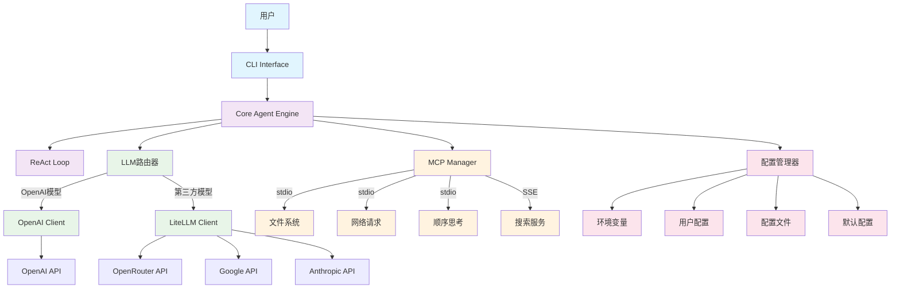
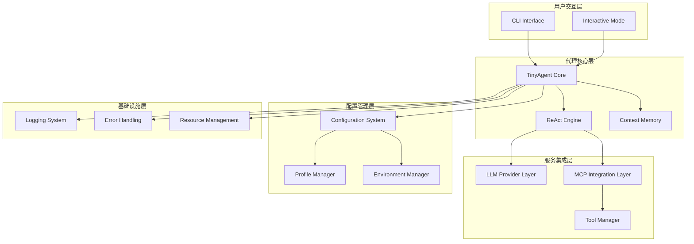
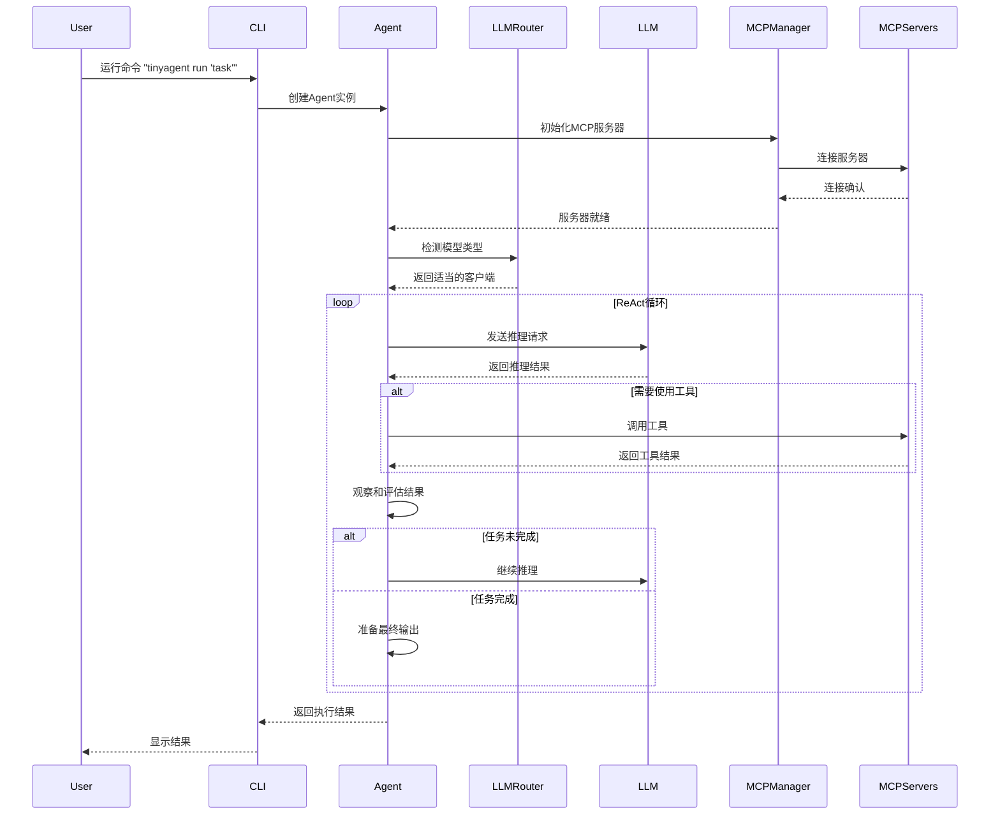
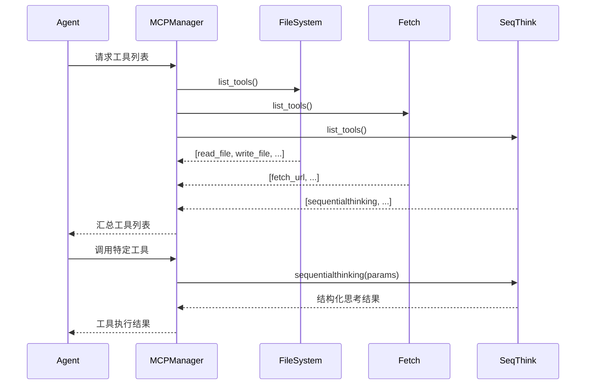
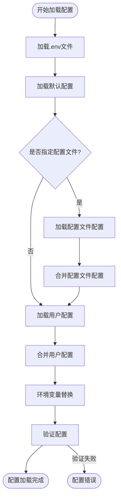
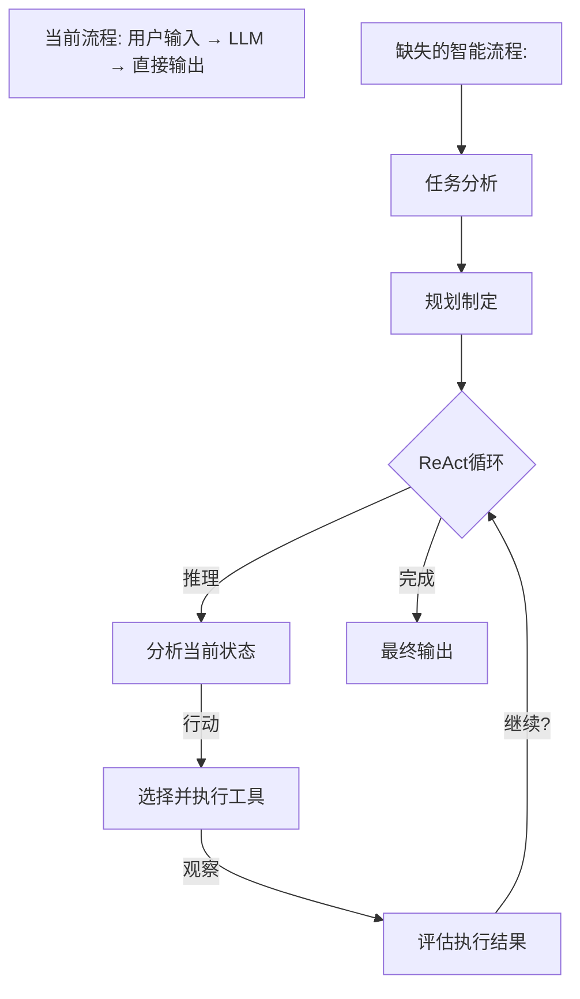

# TinyAgent 设计文档
*版本: 1.2*  
*创建日期: 2025-06-01*  
*基于: TinyAgent v0.1.0*

## 1. 项目概述

TinyAgent是一个基于Python的通用多步骤AI代理框架，专为复杂任务自动化而设计。它采用ReAct（推理与行动）循环模式，通过Model Context Protocol (MCP)实现工具集成，支持100+大语言模型，具备强大的扩展性和配置灵活性。

### 核心价值主张
- **智能代理框架**：基于OpenAI Agents SDK构建的生产级代理系统
- **工具生态系统**：通过MCP协议集成丰富的外部工具
- **多模型支持**：自动路由OpenAI、Google、Anthropic、DeepSeek等100+模型
- **配置驱动**：分层配置系统支持开发到生产的无缝部署
- **易于扩展**：模块化架构便于添加新功能和工具

## 2. 核心特性

### 2.1 智能代理能力
- ✅ **ReAct循环**：推理-行动-观察的循环决策模式
- ✅ **对话上下文管理**：维护多轮对话的完整上下文
- ✅ **任务规划执行**：自动分解复杂任务并逐步执行
- ✅ **错误恢复机制**：优雅处理执行失败和异常情况

### 2.2 多模型LLM支持
- ✅ **双层架构**：OpenAI原生客户端 + LiteLLM第三方模型路由
- ✅ **自动模型检测**：基于模型前缀自动选择适当的客户端
- ✅ **100+ 模型支持**：Google Gemini、Anthropic Claude、DeepSeek等
- ✅ **OpenRouter集成**：默认使用OpenRouter作为统一模型网关

### 2.3 MCP工具集成
- ✅ **多服务器支持**：同时连接多个MCP服务器
- ✅ **容错机制**：单个服务器失败不影响其他服务器
- ✅ **三种传输协议**：stdio、SSE、HTTP支持
- ✅ **动态工具发现**：自动发现和加载可用工具

### 2.4 配置管理系统
- ✅ **分层配置**：环境变量 > 用户配置 > 配置文件 > 默认值
- ✅ **环境变量集成**：完整的.env文件支持
- ✅ **配置文件支持**：开发、生产、自定义配置文件
- ✅ **安全凭证管理**：API密钥通过环境变量安全管理

### 2.5 用户界面
- ✅ **命令行界面**：完整的CLI工具集
- ✅ **文档生成**：PRD、设计文档、分析报告生成
- ✅ **交互模式**：支持持续对话的交互式模式
- ✅ **状态监控**：配置状态和服务器健康检查

## 3. 系统架构

### 3.1 架构概览



### 3.2 分层架构设计



## 4. 核心组件详解

### 4.1 Core Agent Engine (`tinyagent/core/agent.py`)

**主要职责：**
- 管理Agent生命周期和ReAct循环
- 协调LLM调用和MCP工具使用
- 处理异步操作和资源管理

**核心类：**
```python
class TinyAgent:
    def __init__(self, config, instructions, model_name, api_key)
    async def run(self, message: str, **kwargs) -> Any
    def run_sync(self, message: str, **kwargs) -> Any
    def _create_model_instance(self, model_name: str) -> Any
    async def _run_with_mcp_servers(self, message: str, **kwargs) -> Any
```

### 4.2 Configuration Manager (`tinyagent/core/config.py`)

**主要职责：**
- 管理分层配置加载
- 处理环境变量替换
- 验证配置完整性

**核心类：**
```python
class ConfigurationManager:
    def load_config(self, profile: Optional[str] = None) -> TinyAgentConfig
    def _load_defaults(self) -> Dict[str, Any]
    def _load_profile(self, profile: str) -> Dict[str, Any]
    def _substitute_env_vars(self, config: Dict[str, Any]) -> Dict[str, Any]
```

### 4.3 MCP Server Manager (`tinyagent/mcp/manager.py`)

**主要职责：**
- 管理多个MCP服务器连接
- 处理不同传输协议（stdio, SSE, HTTP）
- 提供工具发现和调用接口

**核心类：**
```python
class MCPServerManager:
    def initialize_servers(self) -> List[Any]
    def get_server_info(self) -> List[MCPServerInfo]
    def create_stdio_server(self, config: MCPServerConfig) -> Any
    def create_sse_server(self, config: MCPServerConfig) -> Any
```

### 4.4 CLI Interface (`tinyagent/cli/main.py`)

**主要职责：**
- 提供命令行用户接口
- 支持各种操作模式
- 处理输入输出和文件操作

**主要命令：**
```bash
tinyagent run "prompt"              # 运行Agent
tinyagent status                    # 检查状态
tinyagent list-profiles             # 列出配置文件
tinyagent generate prd "title"      # 生成PRD
tinyagent interactive               # 交互模式
```

## 5. 工作流程

### 5.1 Agent执行流程



### 5.2 MCP工具调用流程



### 5.3 配置加载流程



## 6. 代码组织结构

```
TinyAgent/
├── tinyagent/                      # 主要包目录
│   ├── __init__.py                 # 包初始化
│   ├── core/                       # 核心模块
│   │   ├── __init__.py
│   │   ├── agent.py               # 主要Agent类
│   │   └── config.py              # 配置管理
│   ├── mcp/                       # MCP集成
│   │   ├── __init__.py
│   │   └── manager.py             # MCP服务器管理
│   ├── llm/                       # LLM提供商（预留）
│   │   └── __init__.py
│   ├── cli/                       # 命令行界面
│   │   ├── __init__.py
│   │   └── main.py                # CLI实现
│   ├── configs/                   # 配置文件
│   │   ├── defaults/              # 默认配置
│   │   │   ├── agent.yaml
│   │   │   ├── llm_providers.yaml
│   │   │   └── mcp_servers.yaml
│   │   ├── profiles/              # 配置文件
│   │   │   ├── development.yaml
│   │   │   ├── production.yaml
│   │   │   └── openrouter.yaml
│   │   └── config/                # 用户配置（可选）
│   └── prompts/                   # 提示词模板
│       ├── default_instructions.txt
│       ├── prd_generator.txt
│       └── system_design.txt
├── memory-bank/                   # 项目记忆库
│   ├── projectbrief.md
│   ├── systemPatterns.md
│   ├── progress.md
│   ├── activeContext.md
│   └── TinyAgent_PRD_v1.0.md
├── tests/                         # 测试文件
│   ├── test_agent.py
│   ├── test_config.py
│   └── test_mcp.py
├── .env                          # 环境变量配置
├── .gitignore
├── requirements.txt              # Python依赖
├── setup.py                      # 安装配置
└── README.md                     # 项目文档
```

## 7. 核心依赖

### 7.1 主要依赖包
```python
# 核心框架
openai-agents[litellm]>=0.0.16      # Agent SDK + LiteLLM支持
python-dotenv>=1.0.0                # 环境变量管理
pyyaml>=6.0                         # YAML配置文件
click>=8.0.0                        # CLI框架

# LLM支持
litellm>=1.0.0                      # 多模型LLM支持
openai>=1.0.0                       # OpenAI API客户端

# MCP支持
# (包含在openai-agents中)

# 开发工具
pytest>=7.0.0                      # 测试框架
black>=23.0.0                       # 代码格式化
mypy>=1.0.0                         # 类型检查
flake8>=6.0.0                       # 代码检查
```

### 7.2 MCP服务器依赖
```bash
# Node.js MCP服务器
npm install -g @modelcontextprotocol/server-filesystem
npm install -g @modelcontextprotocol/server-fetch

# 或本地构建
# 自定义MCP服务器在相应目录
```

## 8. 使用指南

### 8.1 快速开始

#### 1. 安装和配置
```bash
# 克隆项目
git clone https://github.com/your-org/TinyAgent
cd TinyAgent

# 创建虚拟环境
python -m venv .venv
.venv\Scripts\activate  # Windows
# 或 source .venv/bin/activate  # Linux/Mac

# 安装依赖
uv pip install -e .

# 配置环境变量
cp .env.template .env
# 编辑.env文件，设置API密钥
echo "OPENROUTER_API_KEY=your-key-here" >> .env
```

#### 2. 基础使用
```bash
# 检查配置状态
python -m tinyagent status

# 运行简单任务
python -m tinyagent run "请帮我分析这个项目的结构"

# 生成PRD文档
python -m tinyagent generate prd "AI聊天机器人项目"

# 交互模式
python -m tinyagent interactive
```

### 8.2 高级使用

#### 1. 使用不同模型
```bash
# 使用Google Gemini
python -m tinyagent run "分析需求" --model "google/gemini-2.0-flash-001"

# 使用Anthropic Claude
python -m tinyagent run "设计系统" --model "anthropic/claude-3.5-sonnet"
```

#### 2. 配置文件管理
```bash
# 使用生产配置文件
python -m tinyagent --profile production status

# 列出可用配置文件
python -m tinyagent list-profiles

# 查看MCP服务器状态
python -m tinyagent list-servers
```

#### 3. 自定义配置
```yaml
# configs/config/agent.yaml - 用户自定义配置
agent:
  name: "MyCustomAgent"
  max_iterations: 20

llm:
  model: "deepseek/deepseek-chat-v3-0324"
  temperature: 0.8

mcp:
  servers:
    filesystem:
      enabled: true
    custom_server:
      enabled: true
      type: "stdio"
      command: "python"
      args: ["my_custom_server.py"]
```

### 8.3 开发扩展

#### 1. 添加新的MCP工具
```yaml
# configs/profiles/development.yaml
mcp:
  servers:
    my_tool:
      enabled: true
      type: "stdio"
      command: "node"
      args: ["./my-mcp-server.js"]
      description: "自定义工具服务器"
      category: "custom_tools"
```

#### 2. 创建自定义提示词
```txt
# prompts/custom_task.txt
你是一个专门处理{task_type}的智能助手。

请按照以下步骤执行任务：
1. 分析输入内容
2. 制定执行计划
3. 使用合适的工具
4. 整理和输出结果

请确保输出格式清晰，内容准确。
```

## 9. 技术特性

### 9.1 性能特性
- **异步执行**：完全异步的MCP服务器连接和工具调用
- **连接池管理**：高效的资源复用和连接管理
- **自动重试**：网络请求和服务连接的自动重试机制
- **错误恢复**：服务器故障时的优雅降级

### 9.2 安全特性
- **凭证隔离**：API密钥通过环境变量安全管理
- **权限控制**：MCP工具的访问权限控制
- **数据隐私**：本地处理优先，最小化数据传输
- **审计日志**：完整的操作日志记录

### 9.3 扩展性特性
- **插件架构**：支持自定义MCP服务器开发
- **模型无关**：支持任意LLM模型的无缝切换
- **配置驱动**：所有核心功能通过配置文件控制
- **API接口**：提供编程接口用于集成开发

## 10. 项目状态

### 当前版本: v0.1.0 (Phase 3完成)
- ✅ **核心Agent框架** - 完全实现
- ✅ **多模型LLM支持** - 100+ 模型支持 
- ✅ **MCP工具集成** - 文件系统、网络请求、顺序思考等
- ✅ **配置管理系统** - 生产级分层配置
- ✅ **CLI用户界面** - 完整命令集

### 下一阶段规划 (Phase 4)
- 🔧 **高级MCP工具** - 数据库、代码分析等工具
- 🔧 **性能优化** - 连接池、缓存、监控
- 🔧 **企业特性** - RBAC、审计、多租户
- 🔧 **Web界面** - 可选的图形化管理界面

---

*本设计文档基于TinyAgent当前架构和实现状态编写，将随项目发展持续更新。* 

## 11. 🚨 **Critical Intelligence Gap Analysis & Fix Epic**
*Added: 2025-06-02*  
*Priority: CRITICAL*  
*Epic Status: IDENTIFIED*

### 11.1 Critical Issue Identification

**问题**: TinyAgent虽然技术栈完善（多模型LLM支持、MCP工具集成、配置管理等），但缺少核心智能能力，表现为：
- 🚫 **无ReAct循环**: 缺少推理→行动→观察的智能决策循环
- 🚫 **无工具智能**: 不知道何时和如何使用已集成的MCP工具
- 🚫 **无对话记忆**: 无法维护对话历史和上下文
- 🚫 **无任务规划**: 无法分解复杂任务为可执行步骤
- 🚫 **无自主执行**: 只是被动回复，没有主动执行能力

### 11.2 Root Cause Analysis

#### 当前架构问题:
```python
# 当前实现 (问题):
async def run(self, message: str, **kwargs) -> Any:
    # 直接调用LLM，没有智能循环
    result = await Runner.run(starting_agent=agent, input=message, **kwargs)
    return result  # 一次性返回，无迭代推理
```

#### 缺失的智能层:


### 11.3 Intelligence Architecture Design

#### 新的智能代理架构:
```python
class IntelligentAgent:
    """智能代理核心类 - 实现完整ReAct循环"""
    
    def __init__(self, llm, tools, memory, planner):
        self.llm = llm                    # LLM推理引擎
        self.tools = tools                # MCP工具管理器
        self.memory = memory              # 对话和任务记忆
        self.planner = planner            # 任务规划器
        self.max_iterations = 10          # 防止无限循环
    
    async def execute_task(self, user_input: str) -> str:
        """执行完整的智能任务流程"""
        # 1. 任务分析和规划
        task_plan = await self.planner.analyze_and_plan(user_input)
        
        # 2. ReAct循环执行
        for iteration in range(self.max_iterations):
            # 推理 (Reasoning)
            reasoning = await self.reason_about_current_state(task_plan)
            
            if reasoning.is_complete:
                break
                
            # 行动 (Acting)
            action_result = await self.take_action(reasoning.next_action)
            
            # 观察 (Observation)
            observation = await self.observe_results(action_result)
            
            # 更新任务状态
            task_plan.update_with_observation(observation)
        
        # 3. 整合最终结果
        return await self.synthesize_final_result(task_plan)
```

#### 核心组件设计:

1. **TaskPlanner** - 任务规划器
```python
class TaskPlanner:
    async def analyze_and_plan(self, user_input: str) -> TaskPlan:
        """分析用户需求并制定执行计划"""
        
    def identify_required_tools(self, task: str) -> List[str]:
        """识别任务所需的工具"""
        
    def decompose_into_steps(self, task: str) -> List[TaskStep]:
        """将复杂任务分解为步骤"""
```

2. **ConversationMemory** - 对话记忆
```python
class ConversationMemory:
    def __init__(self):
        self.conversation_history = []
        self.task_context = {}
        self.tool_usage_history = []
    
    def add_exchange(self, user_input: str, agent_response: str):
        """添加对话记录"""
    
    def get_relevant_context(self, current_input: str) -> str:
        """获取相关上下文"""
```

3. **ToolSelector** - 工具选择器
```python
class ToolSelector:
    def __init__(self, available_tools: Dict[str, Any]):
        self.tools = available_tools
        
    async def select_best_tool(self, task_step: TaskStep) -> str:
        """基于任务步骤选择最合适的工具"""
        
    def can_handle_task(self, tool_name: str, task: str) -> bool:
        """判断工具是否能处理特定任务"""
```

### 11.4 Implementation Epic

#### **Epic: TinyAgent Intelligence Implementation**
**Epic ID**: EPIC-001  
**Priority**: P0 (Critical)  
**Estimated Effort**: 2-3 weeks  
**Dependencies**: Current MCP integration, LLM provider system

#### Phase 1: Core Intelligence Framework (Week 1)
- **Story 1.1**: 实现TaskPlanner组件
  - 任务分析和分解逻辑
  - 工具需求识别
  - 执行步骤规划
  
- **Story 1.2**: 实现ConversationMemory组件
  - 对话历史管理
  - 上下文相关性计算
  - 任务状态跟踪
  
- **Story 1.3**: 实现ToolSelector组件
  - 基于任务的工具选择逻辑
  - 工具能力映射
  - 执行结果评估

#### Phase 2: ReAct Loop Implementation (Week 2)
- **Story 2.1**: 实现推理引擎 (Reasoning)
  - 当前状态分析
  - 下一步行动决策
  - 完成状态判断
  
- **Story 2.2**: 实现行动执行器 (Acting)
  - 工具调用管理
  - 参数智能生成
  - 执行状态监控
  
- **Story 2.3**: 实现观察器 (Observation)
  - 结果质量评估
  - 错误检测和处理
  - 进度更新

#### Phase 3: Integration & Testing (Week 3)
- **Story 3.1**: 集成新智能架构到现有TinyAgent
  - 保持向后兼容
  - 配置系统集成
  - 错误处理改进
  
- **Story 3.2**: 端到端测试和优化
  - 复杂任务测试场景
  - 性能优化
  - 用户体验改进

### 11.5 Success Metrics

#### 核心能力指标:
- ✅ **任务完成率**: 复杂任务的成功完成比例 (目标: >80%)
- ✅ **工具使用智能**: 正确选择和使用工具的比例 (目标: >90%)
- ✅ **对话连贯性**: 多轮对话的上下文保持能力 (目标: >85%)
- ✅ **任务分解准确性**: 复杂任务正确分解的比例 (目标: >75%)

#### 用户体验指标:
- ✅ **响应质量**: 用户满意度评分 (目标: >4.0/5.0)
- ✅ **执行效率**: 平均任务完成时间 (目标: <2分钟)
- ✅ **错误恢复**: 错误后的自动恢复能力 (目标: >70%)

### 11.6 Technical Implementation Plan

#### 文件结构更新:
```
tinyagent/
├── intelligence/              # 新增智能模块
│   ├── __init__.py
│   ├── planner.py            # 任务规划器
│   ├── memory.py             # 对话记忆
│   ├── reasoner.py           # 推理引擎
│   ├── actor.py              # 行动执行器
│   ├── observer.py           # 观察器
│   └── selector.py           # 工具选择器
├── core/
│   ├── agent.py              # 增强现有Agent类
│   └── intelligent_agent.py  # 新的智能代理类
└── prompts/
    ├── reasoning_prompts.txt  # 推理提示词
    ├── planning_prompts.txt   # 规划提示词
    └── reflection_prompts.txt # 反思提示词
```

#### 配置增强:
```yaml
# configs/profiles/development.yaml
intelligence:
  enabled: true
  max_iterations: 10
  reasoning_depth: 3
  memory_retention: 100  # 保留最近100轮对话
  
  planner:
    decomposition_strategy: "hierarchical"
    tool_selection_strategy: "capability_based"
  
  memory:
    context_window: 50
    relevance_threshold: 0.7
```

### 11.7 Risk Mitigation

| 风险 | 概率 | 影响 | 缓解措施 |
|------|------|------|----------|
| 推理循环无限迭代 | 中 | 高 | 实现最大迭代限制和智能终止条件 |
| 工具选择错误 | 中 | 中 | 多层验证和回退机制 |
| 性能影响 | 高 | 中 | 异步执行和缓存优化 |
| 向后兼容性破坏 | 低 | 高 | 保持现有API，新功能可选启用 |

### 11.8 Next Steps

1. **立即行动** (本周):
   - 创建intelligence模块框架
   - 实现基础TaskPlanner类
   - 编写推理提示词模板

2. **短期目标** (2周内):
   - 完成Phase 1和Phase 2开发
   - 实现基本的ReAct循环

3. **中期目标** (1月内):
   - 完成完整智能架构集成
   - 通过所有核心能力测试

**这个Epic将彻底解决TinyAgent的智能缺失问题，将其从简单的LLM包装器转变为真正的智能代理。**

---

*这个Epic和实施计划解决了TinyAgent最关键的架构缺陷，是项目成功的关键里程碑。* 