# TinyAgent 设计文档
*版本: 1.2*  
*创建日期: 2025-06-01*  
*基于: TinyAgent v0.1.0*

## 1. 项目概述

TinyAgent是一个基于Python的通用多步骤AI代理框架，专为复杂任务自动化而设计。它采用ReAct（推理与行动）循环模式，通过Model Context Protocol (MCP)实现工具集成，支持100+大语言模型，具备强大的扩展性和配置灵活性。

### 核心价值主张
- **智能代理框架**：基于OpenAI Agents SDK构建的生产级代理系统
- **工具生态系统**：通过MCP协议集成丰富的外部工具
- **多模型支持**：自动路由OpenAI、Google、Anthropic、DeepSeek等100+模型
- **配置驱动**：分层配置系统支持开发到生产的无缝部署
- **易于扩展**：模块化架构便于添加新功能和工具

## 2. 核心特性

### 2.1 智能代理能力
- ✅ **ReAct循环**：推理-行动-观察的循环决策模式
- ✅ **对话上下文管理**：维护多轮对话的完整上下文
- ✅ **任务规划执行**：自动分解复杂任务并逐步执行
- ✅ **错误恢复机制**：优雅处理执行失败和异常情况

### 2.2 多模型LLM支持
- ✅ **双层架构**：OpenAI原生客户端 + LiteLLM第三方模型路由
- ✅ **自动模型检测**：基于模型前缀自动选择适当的客户端
- ✅ **100+ 模型支持**：Google Gemini、Anthropic Claude、DeepSeek等
- ✅ **OpenRouter集成**：默认使用OpenRouter作为统一模型网关

### 2.3 MCP工具集成
- ✅ **多服务器支持**：同时连接多个MCP服务器
- ✅ **容错机制**：单个服务器失败不影响其他服务器
- ✅ **三种传输协议**：stdio、SSE、HTTP支持
- ✅ **动态工具发现**：自动发现和加载可用工具

### 2.4 配置管理系统
- ✅ **分层配置**：环境变量 > 用户配置 > 配置文件 > 默认值
- ✅ **环境变量集成**：完整的.env文件支持
- ✅ **配置文件支持**：开发、生产、自定义配置文件
- ✅ **安全凭证管理**：API密钥通过环境变量安全管理

### 2.5 用户界面
- ✅ **命令行界面**：完整的CLI工具集
- ✅ **文档生成**：PRD、设计文档、分析报告生成
- ✅ **交互模式**：支持持续对话的交互式模式
- ✅ **状态监控**：配置状态和服务器健康检查

## 3. 系统架构

### 3.1 架构概览

```mermaid
graph TB
    %% User Layer
    User[用户] --> CLI[CLI Interface]
    
    %% Core Layer
    CLI --> CoreAgent[Core Agent Engine]
    CoreAgent --> ReActLoop[ReAct Loop]
    
    %% LLM Layer
    CoreAgent --> LLMRouter[LLM路由器]
    LLMRouter --> |OpenAI模型| OpenAIClient[OpenAI Client]
    LLMRouter --> |第三方模型| LiteLLM[LiteLLM Client]
    
    %% External Services
    OpenAIClient --> OpenAI[OpenAI API]
    LiteLLM --> OpenRouter[OpenRouter API]
    LiteLLM --> Google[Google API]
    LiteLLM --> Anthropic[Anthropic API]
    
    %% MCP Layer
    CoreAgent --> MCPManager[MCP Manager]
    MCPManager --> |stdio| FileSystem[文件系统]
    MCPManager --> |stdio| Fetch[网络请求]
    MCPManager --> |stdio| SeqThink[顺序思考]
    MCPManager --> |SSE| SearchService[搜索服务]
    
    %% Configuration Layer
    CoreAgent --> ConfigManager[配置管理器]
    ConfigManager --> EnvVars[环境变量]
    ConfigManager --> UserConfig[用户配置]
    ConfigManager --> Profiles[配置文件]
    ConfigManager --> Defaults[默认配置]
    
    %% Styling
    classDef userLayer fill:#e1f5fe
    classDef coreLayer fill:#f3e5f5
    classDef llmLayer fill:#e8f5e8
    classDef mcpLayer fill:#fff3e0
    classDef configLayer fill:#fce4ec
    
    class User,CLI userLayer
    class CoreAgent,ReActLoop coreLayer
    class LLMRouter,OpenAIClient,LiteLLM llmLayer
    class MCPManager,FileSystem,Fetch,SeqThink,SearchService mcpLayer
    class ConfigManager,EnvVars,UserConfig,Profiles,Defaults configLayer
```



### 3.2 分层架构设计


## 4. 核心组件详解

### 4.1 Core Agent Engine (`tinyagent/core/agent.py`)

**主要职责：**
- 管理Agent生命周期和ReAct循环
- 协调LLM调用和MCP工具使用
- 处理异步操作和资源管理

**核心类：**
```python
class TinyAgent:
    def __init__(self, config, instructions, model_name, api_key)
    async def run(self, message: str, **kwargs) -> Any
    def run_sync(self, message: str, **kwargs) -> Any
    def _create_model_instance(self, model_name: str) -> Any
    async def _run_with_mcp_servers(self, message: str, **kwargs) -> Any
```

### 4.2 Configuration Manager (`tinyagent/core/config.py`)

**主要职责：**
- 管理分层配置加载
- 处理环境变量替换
- 验证配置完整性

**核心类：**
```python
class ConfigurationManager:
    def load_config(self, profile: Optional[str] = None) -> TinyAgentConfig
    def _load_defaults(self) -> Dict[str, Any]
    def _load_profile(self, profile: str) -> Dict[str, Any]
    def _substitute_env_vars(self, config: Dict[str, Any]) -> Dict[str, Any]
```

### 4.3 MCP Server Manager (`tinyagent/mcp/manager.py`)

**主要职责：**
- 管理多个MCP服务器连接
- 处理不同传输协议（stdio, SSE, HTTP）
- 提供工具发现和调用接口

**核心类：**
```python
class MCPServerManager:
    def initialize_servers(self) -> List[Any]
    def get_server_info(self) -> List[MCPServerInfo]
    def create_stdio_server(self, config: MCPServerConfig) -> Any
    def create_sse_server(self, config: MCPServerConfig) -> Any
```

### 4.4 CLI Interface (`tinyagent/cli/main.py`)

**主要职责：**
- 提供命令行用户接口
- 支持各种操作模式
- 处理输入输出和文件操作

**主要命令：**
```bash
tinyagent run "prompt"              # 运行Agent
tinyagent status                    # 检查状态
tinyagent list-profiles             # 列出配置文件
tinyagent generate prd "title"      # 生成PRD
tinyagent interactive               # 交互模式
```

## 5. 工作流程

### 5.1 Agent执行流程

```mermaid
sequenceDiagram
    participant User
    participant CLI
    participant Agent
    participant LLMRouter
    participant LLM
    participant MCPManager
    participant MCPServers
    
    User->>CLI: 运行命令 "tinyagent run 'task'"
    CLI->>Agent: 创建Agent实例
    Agent->>MCPManager: 初始化MCP服务器
    MCPManager->>MCPServers: 连接服务器
    MCPServers-->>MCPManager: 连接确认
    MCPManager-->>Agent: 服务器就绪
    
    Agent->>LLMRouter: 检测模型类型
    LLMRouter-->>Agent: 返回适当的客户端
    
    loop ReAct循环
        Agent->>LLM: 发送推理请求
        LLM-->>Agent: 返回推理结果
        
        alt 需要使用工具
            Agent->>MCPServers: 调用工具
            MCPServers-->>Agent: 返回工具结果
        end
        
        Agent->>Agent: 观察和评估结果
        
        alt 任务未完成
            Agent->>LLM: 继续推理
        else 任务完成
            Agent->>Agent: 准备最终输出
        end
    end
    
    Agent-->>CLI: 返回执行结果
    CLI-->>User: 显示结果
```



### 5.2 MCP工具调用流程

```mermaid
sequenceDiagram
    participant Agent
    participant MCPManager
    participant FileSystem
    participant Fetch
    participant SeqThink
    
    Agent->>MCPManager: 请求工具列表
    MCPManager->>FileSystem: list_tools()
    MCPManager->>Fetch: list_tools()
    MCPManager->>SeqThink: list_tools()
    
    FileSystem-->>MCPManager: [read_file, write_file, ...]
    Fetch-->>MCPManager: [fetch_url, ...]
    SeqThink-->>MCPManager: [sequentialthinking, ...]
    
    MCPManager-->>Agent: 汇总工具列表
    
    Agent->>MCPManager: 调用特定工具
    MCPManager->>SeqThink: sequentialthinking(params)
    SeqThink-->>MCPManager: 结构化思考结果
    MCPManager-->>Agent: 工具执行结果
```



### 5.3 配置加载流程

```mermaid
flowchart TD
    Start([开始加载配置]) --> LoadEnv[加载.env文件]
    LoadEnv --> LoadDefaults[加载默认配置]
    LoadDefaults --> CheckProfile{是否指定配置文件?}
    
    CheckProfile -->|是| LoadProfile[加载配置文件配置]
    CheckProfile -->|否| LoadUser[加载用户配置]
    LoadProfile --> MergeProfile[合并配置文件配置]
    MergeProfile --> LoadUser
    
    LoadUser --> MergeUser[合并用户配置]
    MergeUser --> SubstituteEnv[环境变量替换]
    SubstituteEnv --> ValidateConfig[验证配置]
    ValidateConfig --> Complete([配置加载完成])
    
    ValidateConfig -->|验证失败| Error([配置错误])
```



## 6. 代码组织结构

```
TinyAgent/
├── tinyagent/                      # 主要包目录
│   ├── __init__.py                 # 包初始化
│   ├── core/                       # 核心模块
│   │   ├── __init__.py
│   │   ├── agent.py               # 主要Agent类
│   │   └── config.py              # 配置管理
│   ├── mcp/                       # MCP集成
│   │   ├── __init__.py
│   │   └── manager.py             # MCP服务器管理
│   ├── llm/                       # LLM提供商（预留）
│   │   └── __init__.py
│   ├── cli/                       # 命令行界面
│   │   ├── __init__.py
│   │   └── main.py                # CLI实现
│   ├── configs/                   # 配置文件
│   │   ├── defaults/              # 默认配置
│   │   │   ├── agent.yaml
│   │   │   ├── llm_providers.yaml
│   │   │   └── mcp_servers.yaml
│   │   ├── profiles/              # 配置文件
│   │   │   ├── development.yaml
│   │   │   ├── production.yaml
│   │   │   └── openrouter.yaml
│   │   └── config/                # 用户配置（可选）
│   └── prompts/                   # 提示词模板
│       ├── default_instructions.txt
│       ├── prd_generator.txt
│       └── system_design.txt
├── memory-bank/                   # 项目记忆库
│   ├── projectbrief.md
│   ├── systemPatterns.md
│   ├── progress.md
│   ├── activeContext.md
│   └── TinyAgent_PRD_v1.0.md
├── tests/                         # 测试文件
│   ├── test_agent.py
│   ├── test_config.py
│   └── test_mcp.py
├── .env                          # 环境变量配置
├── .gitignore
├── requirements.txt              # Python依赖
├── setup.py                      # 安装配置
└── README.md                     # 项目文档
```

## 7. 核心依赖

### 7.1 主要依赖包
```python
# 核心框架
openai-agents[litellm]>=0.0.16      # Agent SDK + LiteLLM支持
python-dotenv>=1.0.0                # 环境变量管理
pyyaml>=6.0                         # YAML配置文件
click>=8.0.0                        # CLI框架

# LLM支持
litellm>=1.0.0                      # 多模型LLM支持
openai>=1.0.0                       # OpenAI API客户端

# MCP支持
# (包含在openai-agents中)

# 开发工具
pytest>=7.0.0                      # 测试框架
black>=23.0.0                       # 代码格式化
mypy>=1.0.0                         # 类型检查
flake8>=6.0.0                       # 代码检查
```

### 7.2 MCP服务器依赖
```bash
# Node.js MCP服务器
npm install -g @modelcontextprotocol/server-filesystem
npm install -g @modelcontextprotocol/server-fetch

# 或本地构建
# 自定义MCP服务器在相应目录
```

## 8. 使用指南

### 8.1 快速开始

#### 1. 安装和配置
```bash
# 克隆项目
git clone https://github.com/your-org/TinyAgent
cd TinyAgent

# 创建虚拟环境
python -m venv .venv
.venv\Scripts\activate  # Windows
# 或 source .venv/bin/activate  # Linux/Mac

# 安装依赖
uv pip install -e .

# 配置环境变量
cp .env.template .env
# 编辑.env文件，设置API密钥
echo "OPENROUTER_API_KEY=your-key-here" >> .env
```

#### 2. 基础使用
```bash
# 检查配置状态
python -m tinyagent status

# 运行简单任务
python -m tinyagent run "请帮我分析这个项目的结构"

# 生成PRD文档
python -m tinyagent generate prd "AI聊天机器人项目"

# 交互模式
python -m tinyagent interactive
```

### 8.2 高级使用

#### 1. 使用不同模型
```bash
# 使用Google Gemini
python -m tinyagent run "分析需求" --model "google/gemini-2.0-flash-001"

# 使用Anthropic Claude
python -m tinyagent run "设计系统" --model "anthropic/claude-3.5-sonnet"
```

#### 2. 配置文件管理
```bash
# 使用生产配置文件
python -m tinyagent --profile production status

# 列出可用配置文件
python -m tinyagent list-profiles

# 查看MCP服务器状态
python -m tinyagent list-servers
```

#### 3. 自定义配置
```yaml
# configs/config/agent.yaml - 用户自定义配置
agent:
  name: "MyCustomAgent"
  max_iterations: 20

llm:
  model: "deepseek/deepseek-chat-v3-0324"
  temperature: 0.8

mcp:
  servers:
    filesystem:
      enabled: true
    custom_server:
      enabled: true
      type: "stdio"
      command: "python"
      args: ["my_custom_server.py"]
```

### 8.3 开发扩展

#### 1. 添加新的MCP工具
```yaml
# configs/profiles/development.yaml
mcp:
  servers:
    my_tool:
      enabled: true
      type: "stdio"
      command: "node"
      args: ["./my-mcp-server.js"]
      description: "自定义工具服务器"
      category: "custom_tools"
```

#### 2. 创建自定义提示词
```txt
# prompts/custom_task.txt
你是一个专门处理{task_type}的智能助手。

请按照以下步骤执行任务：
1. 分析输入内容
2. 制定执行计划
3. 使用合适的工具
4. 整理和输出结果

请确保输出格式清晰，内容准确。
```

## 9. 技术特性

### 9.1 性能特性
- **异步执行**：完全异步的MCP服务器连接和工具调用
- **连接池管理**：高效的资源复用和连接管理
- **自动重试**：网络请求和服务连接的自动重试机制
- **错误恢复**：服务器故障时的优雅降级

### 9.2 安全特性
- **凭证隔离**：API密钥通过环境变量安全管理
- **权限控制**：MCP工具的访问权限控制
- **数据隐私**：本地处理优先，最小化数据传输
- **审计日志**：完整的操作日志记录

### 9.3 扩展性特性
- **插件架构**：支持自定义MCP服务器开发
- **模型无关**：支持任意LLM模型的无缝切换
- **配置驱动**：所有核心功能通过配置文件控制
- **API接口**：提供编程接口用于集成开发

## 10. 项目状态

### 当前版本: v0.1.0 (Phase 3完成)
- ✅ **核心Agent框架** - 完全实现
- ✅ **多模型LLM支持** - 100+ 模型支持 
- ✅ **MCP工具集成** - 文件系统、网络请求、顺序思考等
- ✅ **配置管理系统** - 生产级分层配置
- ✅ **CLI用户界面** - 完整命令集

### 下一阶段规划 (Phase 4)
- 🔧 **高级MCP工具** - 数据库、代码分析等工具
- 🔧 **性能优化** - 连接池、缓存、监控
- 🔧 **企业特性** - RBAC、审计、多租户
- 🔧 **Web界面** - 可选的图形化管理界面

---

*本设计文档基于TinyAgent当前架构和实现状态编写，将随项目发展持续更新。* 